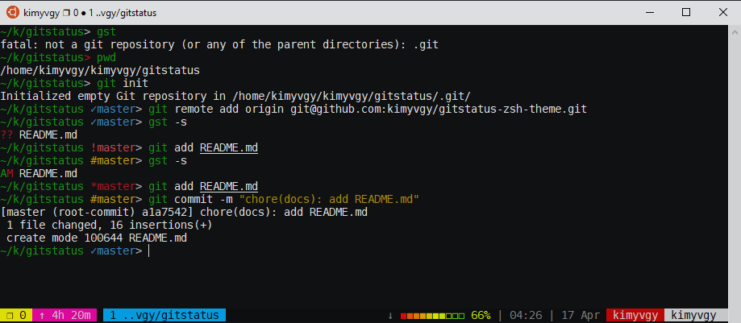

## Gitstatus ZSH theme

Fish-like [gitstatus](https://github.com/oh-my-fish/theme-gitstatus) theme for ZSH. Simple is the best!



### Features

- Shows command return status
- Show full pwd
- Support Fish-like shrink path
```bash
# shrink path is enabled:
/home/kimyvgy/kimnh-0823/mayfest/docker -> ~/k/m/docker

# shrink path is disabled:
/home/kimyvgy/kimnh-0823/mayfest/docker -> ~/kimnh-0823/mayfest/docker
```
- Show git status (branch, color)

### Installation

- Clone this repository into `~/.oh-my-zsh/custom/themes` folder:
```bash
git clone https://github.com/kimyvgy/gitstatus-zsh-theme.git ${ZSH_CUSTOM}/themes/gitstatus
```
- Activate this theme in `~/.zshrc` file:
```bash
ZSH_THEME="gitstatus/gitstatus"
```
- Apply theme:
```bash
source ~/.zshrc
```
